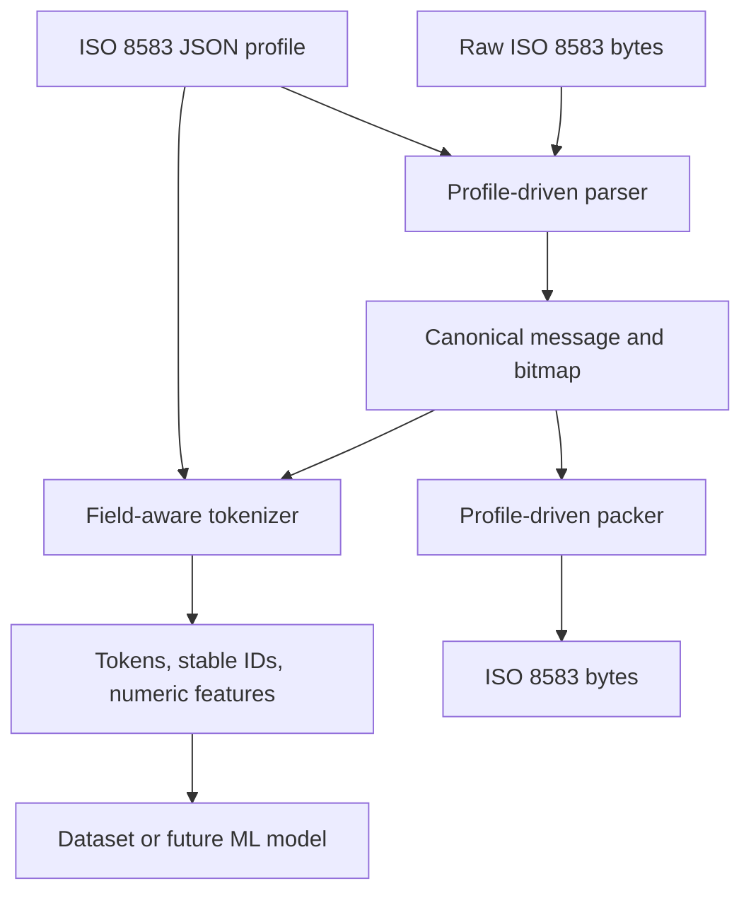

# ISO 8583 Tokenizer

A Python PoC that parses Openly Available ISO 8583 messages formats into a canonical representation, creates field-aware tokens and stable token IDs.

## Architecture



The profile supplies the message MTI, field names and source types, field lengths, requirement notes, semantic types, and wire-encoding settings. The parser and tokenizer use profile data rather than embedding processor-specific field-position rules in tokenizer logic.

## Functionality

- **Mapping import:** compiles the supplied `mapping.txt` tables into machine-readable JSON profiles. The supplied tables generate profiles for 0100 Authorization Request and 0200 Financial Transaction Request.
- **ISO parsing:** reads the MTI, primary and optional secondary bitmap, present data elements, fixed-length fields, and variable-length fields with configured length prefixes. Wire settings can select bitmap encoding, text encoding, length-prefix encoding, per-field encodings, and optional terminal header handling through the Python API.
- **Canonical messages:** represents a parsed message with profile, MTI, bitmap values, header, and named field values. Canonical messages can also be created from dictionaries and packed back into bytes.
- **Field-aware tokenization:** emits message and field structure, optional bitmap-presence tokens, and typed value tokens. Values do not become vocabulary entries. Profile semantic-value mappings can emit configured categorical tokens.
- **Numerical features:** emits numeric features for parseable numeric fields, retaining their source numeric units and spelling separately in the canonical message.
- **Sensitive-value handling:** fields marked sensitive emit a generic sensitive-value token rather than their raw value. Identifier-like values use generic identifier tokens. When a key is supplied, the tokenizer can also emit deterministic keyed HMAC-SHA-256 digests as metadata.
- **Deterministic vocabulary:** generates stable token-to-ID assignments from a fixed ordered vocabulary and profile semantic tokens, and can save the vocabulary as JSON.
- **Transaction sequences:** combines message token sequences using transaction start/end tokens and explicit message boundaries, supporting future multi-message datasets.
- **Synthetic fixtures:** creates deterministic synthetic messages with top-level mandatory fields for parser and tokenizer testing.
- **CLI:** provides commands to compile profiles, generate a fixture, parse a message, tokenize it, run a round trip, and save a vocabulary.
- **Tests:** verifies mapping import, bitmap parsing, variable fields, BCD configuration, invalid or missing data, deterministic vocabulary IDs, sensitive tokenization, sequence boundaries, and round-trip behavior.

## Setup

Requires Python 3.11 or later. There are no runtime third-party dependencies. Run commands from the project root—the directory containing `mapping.txt`, `profiles/`, and `iso_tokenizer/`.

Compile the profiles from the mapping:

```powershell
python -m iso_tokenizer.cli build-profiles mapping.txt --out profiles/iso8583
```

This creates:

- `profiles/iso8583/authorization.json` — MTI 0100
- `profiles/iso8583/financial_request.json` — MTI 0200

## Quick start

Generate a synthetic authorization fixture, inspect it, tokenize it, and verify its round trip:

```powershell
python -m iso_tokenizer.cli generate --profile profiles/iso8583/authorization.json --out synthetic.bin
python -m iso_tokenizer.cli parse synthetic.bin --profile profiles/iso8583/authorization.json
python -m iso_tokenizer.cli tokenize synthetic.bin --profile profiles/iso8583/authorization.json
python -m iso_tokenizer.cli roundtrip synthetic.bin --profile profiles/iso8583/authorization.json
```

For a synthetic 0200 fixture, replace `authorization.json` with `financial_request.json` in the profile argument. CLI parse output redacts sensitive and identifier-like values. Tokenization output includes tokens, token IDs, numeric features, and configured keyed digests.

Available commands:

```text
python -m iso_tokenizer.cli build-profiles [mapping.txt] --out profiles/iso8583
python -m iso_tokenizer.cli generate --profile PROFILE.json --out MESSAGE.bin
python -m iso_tokenizer.cli parse MESSAGE.bin --profile PROFILE.json
python -m iso_tokenizer.cli tokenize MESSAGE.bin --profile PROFILE.json
python -m iso_tokenizer.cli roundtrip MESSAGE.bin --profile PROFILE.json
python -m iso_tokenizer.cli vocabulary --profile PROFILE.json --out vocab.json
```

Run the test suite with:

```powershell
python -m unittest discover -s tests
```

## Python API

```python
from iso_tokenizer import ISO8583Parser, ISO8583Tokenizer, ISOProfile

profile = ISOProfile.load("profiles/iso8583/authorization.json")
parser = ISO8583Parser(profile)
message = parser.parse(raw_bytes)

tokenizer = ISO8583Tokenizer(
    profile,
    pseudonymization_key=key_from_secure_configuration,
    include_bitmap_tokens=True,
)
result = tokenizer.tokenize(message)
print(result.public_dict())

rebuilt_bytes = parser.pack(message)
restored_message = tokenizer.detokenize(result)
```

`result.public_dict()` provides the public tokenization output. The tokenization result also keeps an in-memory canonical snapshot so `detokenize(result)` can restore field values exactly. The token IDs by themselves are intentionally not a lossless serialization; `decode()` needs the matching tokenization result as a sidecar.

Sequence tokenization is available through `tokenize_sequence([(tokenizer, message), ...])` in `iso_tokenizer.sequence`. `detokenize_sequence(result)` restores the sequence's canonical messages from its in-memory sidecar.

## Extending a profile

Add a documented MTI table to the mapping, compile the updated mapping, then configure that profile's wire settings and semantic-value mappings. The parser and tokenizer operate on the loaded profile, allowing additional message types to use the same processing flow.

## Disclaimer

This is a research PoC, not a payment-processing or certification implementation. Confirm wire encodings, framing, conditional requirements, and any composite-field layouts against the applicable interface specification before using real messages. Use synthetic data for development. Do not log or persist raw sensitive values or the in-memory canonical sidecar; protect pseudonymization keys using an approved secrets-management process.
